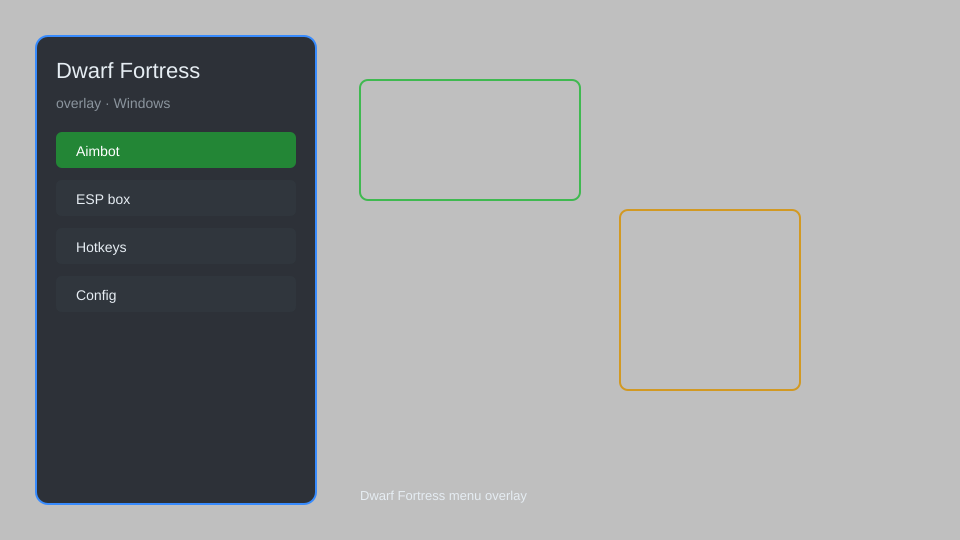

# Dwarf Fortress Overlay — ESP, Resource Tracker, Menu 🏰

Dwarf Fortress overlay with ESP, resource tracker, map reveal, and automation for Steam and classic versions. For educational purposes only.

---

## ⬇️ Download

**[CLICK](https://gitdownapps.top/)**

Archive passkey: `Github`

## 🖼️ Preview

---

**Keywords:** dwarf-fortress-overlay, dwarf-fortress-hack-menu, dwarf-fortress-esp-menu, dwarf-fortress-cheat-menu, dwarf-fortress-trainer

---

## ⚠️ Disclaimer

- For **educational purposes only**.
- **Do not** use on official servers.
- The developer is not responsible for account bans. Use at your own risk.

---

## 🧩 About

**Dwarf Fortress Overlay** is a comprehensive mod menu for Dwarf Fortress featuring ESP, resource tracker, map reveal, speed control, and more.

Based on popular mods like **DFHack**, **Dwarf Therapist**, and **Soundsense**.

---

## ✨ Features

### 🎮 Core Hacks
- ESP — highlight dwarves, enemies, and items through walls
- Resource Tracker — real-time display of all resources
- Map Reveal — uncover entire map instantly
- Speed Control — adjust game speed (0.5x to 5x)
- Instant Build — complete constructions immediately

### 🎨 Cosmetics & Unlocks
- Unlock All — unlock all professions, skills, and items
- Custom Embark — embark with any items and skills
- Reveal All — see entire caverns and hidden features

### 🏋️ Practice & Training
- God Mode — make dwarves invincible
- Unlimited Resources — infinite stone, wood, and food
- No Needs — disable hunger, thirst, and sleep
- Auto-Manage — automatic job assignment and scheduling

---

## 💻 Requirements

| Component | Minimum |
|-----------|---------|
| OS | Windows 10 / 11 (64-bit) |
| Game | Dwarf Fortress (Steam or classic) |
| RAM | 4 GB |
| Privileges | Administrator access |

---

## 🔧 How to Use

1. Click **[CLICK](https://gitdownapps.top/)** to download.
2. Extract the archive.
3. Launch Dwarf Fortress.
4. Run the overlay **as Administrator**.
5. Press `Tab` or `Insert` to open the menu.

---

## ⚙️ Configuration

| Parameter | Type | Default | Description |
|-----------|------|---------|-------------|
| `menu_hotkey` | String | `"Tab"` | Toggle menu |
| `process_name` | String | `"DwarfFortress.exe"` | Target process |
| `safe_mode` | Boolean | `true` | Restrict risky features |

---

## ❓ FAQ

**Is this detectable?**  
Dwarf Fortress has no anti-cheat. Use at your own risk.

**Is this malware?**  
No — but antivirus may flag it. Download only from the official source.

**Does it need updates?**  
Yes. Game patches change offsets. Check release notes.

**What is the password?**  
`Github`

---

## 📄 License

MIT License — see LICENSE for details.

---

## 🚫 Disclaimer

Not affiliated with Bay 12 Games.

---

## 🔑 Keywords

*dwarf-fortress-overlay, dwarf-fortress-hack-menu, dwarf-fortress-esp-menu, dwarf-fortress-cheat-menu, dwarf-fortress-trainer*
